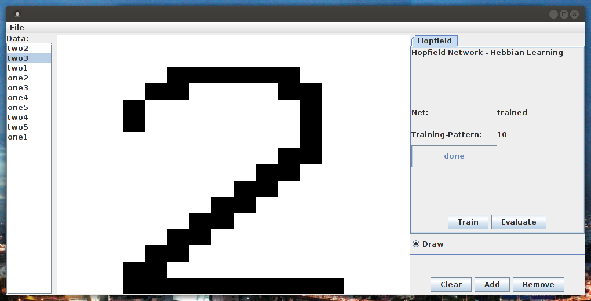

# HopfieldNet

A small little GUI that lets you play around with a [Hopfield network](https://en.wikipedia.org/wiki/Hopfield_network) that can be trained with Hebbian learning. Training data can be easily created by drawing on a 16x16 pixel canvas.

In brief, a Hopfield network is a fully connected network of binary threshold units (i.e., activation is either -1 or 1) with symmetric weights. Based on the given training data, the network just learns certain activation patterns - in this case by applying Hebbian learning. When presented with novel data, the activation of the network will converge to one of the learned activation patterns.

I added a `JAR` file to the project for convenience. So, if you really want to give it a spin, just run:
`java -jar HopfieldNet.jar`

##### Using the GUI

Clicking on any pixel on the canvas will set its color to black - or white, if the `Draw` box is unticked. Clicking the `Add` button will add the image on the canvas to the data set (list on the left) - a pop-up window will ask for a label. Obviously, clicking the `Remove` button will remove the selected image from the data set. Clicking `Clear` will clear the canvas. If you really want to take it to the next level, you can even save your data set to reuse it later :) - click on `File` and select `Save data`.
As soon as you're happy with your data set you can train the network by clicking on `Train`. Now, to test how good the training worked, clear the canvas, draw anything onto it, and see to which pattern the network will converge. Isn't it fun? :)

---
#### (Nostalgic) note
If somebody really read this up to here, you might be wondering, why the hell did I do this? Well, I implemented this back in 2008 as my "final project" in a course on intelligent system engineering at the Auckland University of Technology during my semester abroad. To make sure that this little fun project will not vanish completely, I decided to conserve it on github.